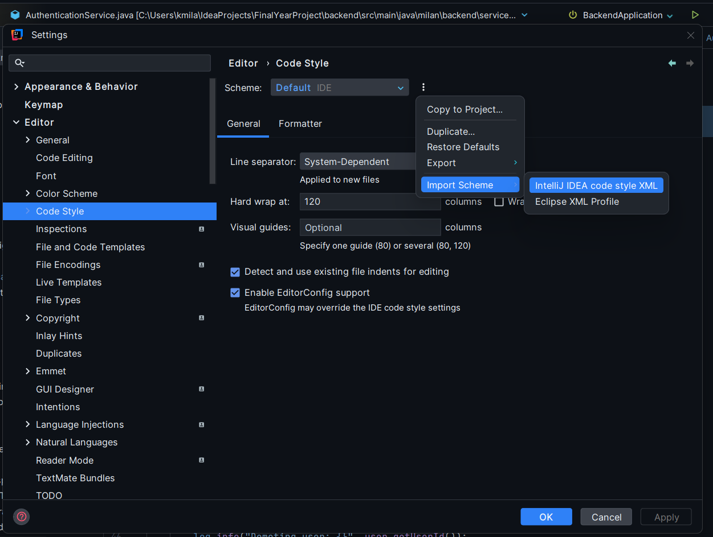

# CS4337 - Big Data Group Project
## Team Member
- Brendan Golden
- Fawad Shahzad
- Euan Bourke
- Killian McCarthy
- Sean Capill
- Milan Kovacs

## Setting up Code Style
To have a standardized and clean code style between each other, I propose the following of an XML I have created over the last year or so. Took inspiration of other companies' coding styles and fine-tuned it to my liking. Lot of inspiration: https://google.github.io/styleguide/javaguide.html

Here is a tutorial for the team on how to add it to your project:

Go to `settings -> Editor -> Code Style` (or search Code Style)
Click on the root header
Click 3 dots beside Scheme
Import Scheme -> IntelliJ XML

Add the file I have shared on Discord.

The file in question is ./CODE_STYLES.xml

KEY TAKEAWAYS:

Limit Wildcard Imports  
Force braces (No one line while, if, etc)  
Indentations  
Formatting for imports  

## Guide to intial building with Maven
Navigate to ``File -> Project Structure``  
Under Modules, Click + (Add) and ``Import Module``  
Navigate to the ``pom.xml`` file in the Microservice directory

Now you can move into the Microservices directory:
``cd Microservices``  
and run Maven:
``mvn clean install``